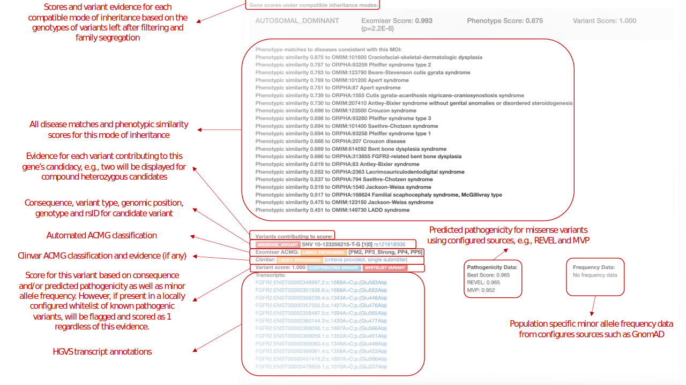

.. _result_interpretation:

========================
Interpreting the Results
========================

Depending on the output options provided, Exomiser will write out at least an HTML results file in the `results`
sub-directory of the Exomiser installation.

As a general rule all output files contain a ranked list of genes and/or variants with the top-ranked gene/variant
displayed first. The exception being the VCF output which, since version 13.1.0, is sorted according to VCF convention
and tabix indexed.

Exomiser attempts to predict the variant or variants likely to be causative of a patient's phenotype and does so by
associating them with the gene (or genes in the case of large structural variations) they intersect with on the genomic
sequence. Variants occurring in intergenic regions are associated to the closest gene and those overlapping two genes
are associated with the gene in which they are predicted to have the largest consequence.

Once associated with a gene, Exomiser uses the compatible modes of inheritance for a variant to assess it in the context
of any diseases associated with the gene or any mouse knockout models of that gene. These are all bundled together into
a `GeneScore` which features filtered variants located in that gene compatible with a given mode of inheritance. After
the filtering steps Exomiser ranks these GeneScores according to descending combined score. The results are then written
out to the files and formats specified in the output settings.

As of release 13.2.0 the output files only feature a single, combined output file of ranked genes/variants e.g.
when supplying the output options (via an output-options.yaml file) `outputFileName: Pfeiffer-hiphive-exome-PASS_ONLY`
and `outputFormats: [TSV_VARIANT, TSV_GENE, VCF]`, the following files will be written out:
`Pfeiffer-hiphive-exome-PASS_ONLY.variants.tsv` `Pfeiffer-hiphive-exome-PASS_ONLY.genes.tsv`,
`Pfeiffer-hiphive-exome-PASS_ONLY.vcf`

These formats are detailed below.

HTML
====

.. figure:: images/exomiser-html-description-1.svg

JSON
====

The JSON file represents the most accurate representation of the data, as it is referenced internally by Exomiser. As
such, we don't provide a schema for this, but it has been pretty stable and breaking changes will only occur with major
version changes to the software. Minor additions are to be expected for minor releases, as per the `SemVer <https://semver.org>`_
specification.

We recommend using `Python <https://docs.python.org/3/library/json.html?highlight=json#module-json>`_ or
`JQ <https://stedolan.github.io/jq/>`_ to extract data from this file.

TSV GENES
=========

In the genes.tsv file it is possible for a gene to appear multiple times, depending on the MOI it is compatible with,
given the filtered variants. For example in the example below MUC6 is ranked 7th under the AD model and 8th under an AR
model.

.. code-block:: tsv

    #RANK	ID	GENE_SYMBOL	ENTREZ_GENE_ID	MOI	P-VALUE	EXOMISER_GENE_COMBINED_SCORE	EXOMISER_GENE_PHENO_SCORE	EXOMISER_GENE_VARIANT_SCORE	HUMAN_PHENO_SCORE	MOUSE_PHENO_SCORE	FISH_PHENO_SCORE	WALKER_SCORE	PHIVE_ALL_SPECIES_SCORE	OMIM_SCORE	MATCHES_CANDIDATE_GENE	HUMAN_PHENO_EVIDENCE	MOUSE_PHENO_EVIDENCE	FISH_PHENO_EVIDENCE	HUMAN_PPI_EVIDENCE	MOUSE_PPI_EVIDENCE	FISH_PPI_EVIDENCE
    1	FGFR2_AD	FGFR2	2263	AD	0.0000	0.9981	1.0000	1.0000	0.8808	1.0000	0.0000	0.5095	1.0000	1.0000	0	Jackson-Weiss syndrome (OMIM:123150): Brachydactyly (HP:0001156)-Broad hallux (HP:0010055), Craniosynostosis (HP:0001363)-Craniosynostosis (HP:0001363), Broad thumb (HP:0011304)-Broad metatarsal (HP:0001783), Broad hallux (HP:0010055)-Broad hallux (HP:0010055), 	Brachydactyly (HP:0001156)-abnormal sternum morphology (MP:0000157), Craniosynostosis (HP:0001363)-premature cranial suture closure (MP:0000081), Broad thumb (HP:0011304)-abnormal sternum morphology (MP:0000157), Broad hallux (HP:0010055)-abnormal sternum morphology (MP:0000157), 		Proximity to FGF14 associated with Spinocerebellar ataxia 27 (OMIM:609307): Broad hallux (HP:0010055)-Pes cavus (HP:0001761), 	Proximity to FGF14 Brachydactyly (HP:0001156)-abnormal digit morphology (MP:0002110), Broad thumb (HP:0011304)-abnormal digit morphology (MP:0002110), Broad hallux (HP:0010055)-abnormal digit morphology (MP:0002110),
    2	ENPP1_AD	ENPP1	5167	AD	0.0049	0.8690	0.5773	0.9996	0.6972	0.5773	0.5237	0.5066	0.6972	1.0000	0	Autosomal recessive hypophosphatemic rickets (ORPHA:289176): Brachydactyly (HP:0001156)-Genu varum (HP:0002970), Craniosynostosis (HP:0001363)-Craniosynostosis (HP:0001363), Broad thumb (HP:0011304)-Tibial bowing (HP:0002982), Broad hallux (HP:0010055)-Genu varum (HP:0002970), 	Brachydactyly (HP:0001156)-fused carpal bones (MP:0008915), Craniosynostosis (HP:0001363)-abnormal nucleus pulposus morphology (MP:0006392), Broad thumb (HP:0011304)-fused carpal bones (MP:0008915), Broad hallux (HP:0010055)-fused carpal bones (MP:0008915), 	Craniosynostosis (HP:0001363)-ceratohyal cartilage premature perichondral ossification, abnormal (ZP:0012007), Broad thumb (HP:0011304)-cleithrum nodular, abnormal (ZP:0006782), 	Proximity to PAPSS2 associated with Brachyolmia 4 with mild epiphyseal and metaphyseal changes (OMIM:612847): Brachydactyly (HP:0001156)-Brachydactyly (HP:0001156), Broad thumb (HP:0011304)-Brachydactyly (HP:0001156), Broad hallux (HP:0010055)-Brachydactyly (HP:0001156), 	Proximity to PAPSS2 Brachydactyly (HP:0001156)-abnormal long bone epiphyseal plate morphology (MP:0003055), Craniosynostosis (HP:0001363)-domed cranium (MP:0000440), Broad thumb (HP:0011304)-abnormal long bone epiphyseal plate morphology (MP:0003055), Broad hallux (HP:0010055)-abnormal long bone epiphyseal plate morphology (MP:0003055),
    //
    7	MUC6_AD	MUC6	4588	AD	0.0096	0.7532	0.5030	0.9990	0.0000	0.0000	0.0000	0.5030	0.5030	1.0000	0					Proximity to GKN2 Brachydactyly (HP:0001156)-brachydactyly (MP:0002544), Broad thumb (HP:0011304)-brachydactyly (MP:0002544), Broad hallux (HP:0010055)-brachydactyly (MP:0002544),
    8	MUC6_AR	MUC6	4588	AR	0.0096	0.7531	0.5030	0.9990	0.0000	0.0000	0.0000	0.5030	0.5030	1.0000	0					Proximity to GKN2 Brachydactyly (HP:0001156)-brachydactyly (MP:0002544), Broad thumb (HP:0011304)-brachydactyly (MP:0002544), Broad hallux (HP:0010055)-brachydactyly (MP:0002544),

TSV VARIANTS
============

In the variants.tsv file it is possible for a variant, like a gene, to appear multiple times, depending on the MOI it is
compatible with. For example in the example below MUC6 has two variants ranked 7th under the AD model and two ranked 8th
under an AR (compound heterozygous) model. In the AD case the CONTRIBUTING_VARIANT column indicates whether the variant
was (1) or wasn't (0) used for calculating the EXOMISER_GENE_COMBINED_SCORE and EXOMISER_GENE_VARIANT_SCORE.

.. code-block:: tsv

    #RANK	ID	GENE_SYMBOL	ENTREZ_GENE_ID	MOI	P-VALUE	EXOMISER_GENE_COMBINED_SCORE	EXOMISER_GENE_PHENO_SCORE	EXOMISER_GENE_VARIANT_SCORE	EXOMISER_VARIANT_SCORE	CONTRIBUTING_VARIANT	WHITELIST_VARIANT	VCF_ID	RS_ID	CONTIG	START	END	REF	ALT	CHANGE_LENGTH	QUAL	FILTER	GENOTYPE	FUNCTIONAL_CLASS	HGVS	EXOMISER_ACMG_CLASSIFICATION	EXOMISER_ACMG_EVIDENCE	EXOMISER_ACMG_DISEASE_ID	EXOMISER_ACMG_DISEASE_NAME	CLINVAR_VARIANT_ID	CLINVAR_PRIMARY_INTERPRETATION	CLINVAR_STAR_RATING	GENE_CONSTRAINT_LOEUF	GENE_CONSTRAINT_LOEUF_LOWER	GENE_CONSTRAINT_LOEUF_UPPER	MAX_FREQ_SOURCE	MAX_FREQ	ALL_FREQ	MAX_PATH_SOURCE	MAX_PATH	ALL_PATH
    1	10-123256215-T-G_AD	FGFR2	2263	AD	0.0000	0.9981	1.0000	1.0000	1.0000	1	1		rs121918506	10	123256215	123256215	T	G	0	100.0000	PASS	1|0	missense_variant	FGFR2:ENST00000346997.2:c.1688A>C:p.(Glu563Ala)	LIKELY_PATHOGENIC	PM2,PP3_Strong,PP4,PP5	OMIM:123150	Jackson-Weiss syndrome	28333	LIKELY_PATHOGENIC	1	0.13692	0.074	0.27				REVEL	0.965	REVEL=0.965,MVP=0.9517972
    2	6-132203615-G-A_AD	ENPP1	5167	AD	0.0049	0.8690	0.5773	0.9996	0.9996	1	0		rs770775549	6	132203615	132203615	G	A	0	922.9800	PASS	0/1	splice_donor_variant	ENPP1:ENST00000360971.2:c.2230+1G>A:p.?	UNCERTAIN_SIGNIFICANCE	PVS1_Strong	OMIM:615522	Cole disease		NOT_PROVIDED	0	0.41042	0.292	0.586	GNOMAD_E_SAS	0.0032486517	TOPMED=7.556E-4,EXAC_NON_FINNISH_EUROPEAN=0.0014985314,GNOMAD_E_NFE=0.0017907989,GNOMAD_E_SAS=0.0032486517
    //
    7	11-1018088-TG-T_AD	MUC6	4588	AD	0.0096	0.7532	0.5030	0.9990	0.9990	1	0		rs765231061	11	1018088	1018089	TG	T	-1	441.8100	PASS	0/1	frameshift_variant	MUC6:ENST00000421673.2:c.4712del:p.(Pro1571Hisfs*21)	UNCERTAIN_SIGNIFICANCE					NOT_PROVIDED	0	0.79622	0.656	0.971	GNOMAD_G_NFE	0.0070363074	GNOMAD_E_AMR=0.0030803352,GNOMAD_G_NFE=0.0070363074
    7	11-1018093-G-GT_AD	MUC6	4588	AD	0.0096	0.7532	0.5030	0.9990	0.9989	0	0		rs376177791	11	1018093	1018093	G	GT	1	592.4500	PASS	0/1	frameshift_elongation	MUC6:ENST00000421673.2:c.4707dup:p.(Pro1570Thrfs*136)	NOT_AVAILABLE					NOT_PROVIDED	0	0.79622	0.656	0.971	GNOMAD_G_NFE	0.007835763	GNOMAD_G_NFE=0.007835763
    8	11-1018088-TG-T_AR	MUC6	4588	AR	0.0096	0.7531	0.5030	0.9990	0.9990	1	0		rs765231061	11	1018088	1018089	TG	T	-1	441.8100	PASS	0/1	frameshift_variant	MUC6:ENST00000421673.2:c.4712del:p.(Pro1571Hisfs*21)	UNCERTAIN_SIGNIFICANCE					NOT_PROVIDED	0	0.79622	0.656	0.971	GNOMAD_G_NFE	0.0070363074	GNOMAD_E_AMR=0.0030803352,GNOMAD_G_NFE=0.0070363074
    8	11-1018093-G-GT_AR	MUC6	4588	AR	0.0096	0.7531	0.5030	0.9990	0.9989	1	0		rs376177791	11	1018093	1018093	G	GT	1	592.4500	PASS	0/1	frameshift_elongation	MUC6:ENST00000421673.2:c.4707dup:p.(Pro1570Thrfs*136)	UNCERTAIN_SIGNIFICANCE					NOT_PROVIDED	0	0.79622	0.656	0.971	GNOMAD_G_NFE	0.007835763	GNOMAD_G_NFE=0.007835763

VCF
===

In the VCF file it is possible for a variant, like a gene, to appear multiple times, depending on the MOI it is
compatible with. For example in the example below MUC6 has two variants ranked 7th under the AD model and two ranked 8th
under an AR (compound heterozygous) model. In the AD case the CONTRIBUTING_VARIANT column indicates whether the variant
was (1) or wasn't (0) used for calculating the EXOMISER_GENE_COMBINED_SCORE and EXOMISER_GENE_VARIANT_SCORE. The ``INFO``
field with the ``ID=Exomiser`` describes the internal format of this sub-field. Be aware that for multi-allelic sites,
Exomiser will decompose and trim them for the proband sample and this is what will be displayed in the Exomiser ``ID``
sub-field e.g. ``11-1018088-TG-T_AD``.

.. code-block:: vcf

    ##INFO=<ID=Exomiser,Number=.,Type=String,Description="A pipe-separated set of values for the proband allele(s) from the record with one per compatible MOI following the format: {RANK|ID|GENE_SYMBOL|ENTREZ_GENE_ID|MOI|P-VALUE|EXOMISER_GENE_COMBINED_SCORE|EXOMISER_GENE_PHENO_SCORE|EXOMISER_GENE_VARIANT_SCORE|EXOMISER_VARIANT_SCORE|CONTRIBUTING_VARIANT|WHITELIST_VARIANT|FUNCTIONAL_CLASS|HGVS|EXOMISER_ACMG_CLASSIFICATION|EXOMISER_ACMG_EVIDENCE|EXOMISER_ACMG_DISEASE_ID|EXOMISER_ACMG_DISEASE_NAME}">
    #CHROM	POS	ID	REF	ALT	QUAL	FILTER	INFO	sample
    10	123256215	.	T	G	100	PASS	Exomiser={1|10-123256215-T-G_AD|FGFR2|2263|AD|0.0000|0.9981|1.0000|1.0000|1.0000|1|1|missense_variant|FGFR2:ENST00000346997.2:c.1688A>C:p.(Glu563Ala)|LIKELY_PATHOGENIC|PM2,PP3_Strong,PP4,PP5|OMIM:123150|"Jackson-Weiss syndrome"};GENE=FGFR2;INHERITANCE=AD;MIM=101600	GT:DS:PL	1|0:2.000:50,11,0
    11	1018088	.	TG	T	441.81	PASS	AC=1;AF=0.50;AN=2;BaseQRankSum=7.677;DP=162;DS;Exomiser={7|11-1018088-TG-T_AD|MUC6|4588|AD|0.0096|0.7532|0.5030|0.9990|0.9990|1|0|frameshift_variant|MUC6:ENST00000421673.2:c.4712del:p.(Pro1571Hisfs*21)|UNCERTAIN_SIGNIFICANCE|||""},{8|11-1018088-TG-T_AR|MUC6|4588|AR|0.0096|0.7531|0.5030|0.9990|0.9990|1|0|frameshift_variant|MUC6:ENST00000421673.2:c.4712del:p.(Pro1571Hisfs*21)|UNCERTAIN_SIGNIFICANCE|||""};FS=25.935;HRun=3;HaplotypeScore=1327.2952;MQ=43.58;MQ0=6;MQRankSum=-5.112;QD=2.31;ReadPosRankSum=2.472;set=variant	GT:AD:DP:GQ:PL	0/1:146,45:162:99:481,0,5488
    11	1018093	.	G	GT	592.45	PASS	AC=1;AF=0.50;AN=2;BaseQRankSum=8.019;DP=157;Exomiser={7|11-1018093-G-GT_AD|MUC6|4588|AD|0.0096|0.7532|0.5030|0.9990|0.9989|0|0|frameshift_elongation|MUC6:ENST00000421673.2:c.4707dup:p.(Pro1570Thrfs*136)|NOT_AVAILABLE|||""},{8|11-1018093-G-GT_AR|MUC6|4588|AR|0.0096|0.7531|0.5030|0.9990|0.9989|1|0|frameshift_elongation|MUC6:ENST00000421673.2:c.4707dup:p.(Pro1570Thrfs*136)|UNCERTAIN_SIGNIFICANCE|||""};FS=28.574;HRun=1;HaplotypeScore=1267.6968;MQ=44.06;MQ0=4;MQRankSum=-5.166;QD=3.26;ReadPosRankSum=1.328;set=variant	GT:AD:DP:GQ:PL	0/1:140,42:157:99:631,0,4411
    6	132203615	.	G	A	922.98	PASS	AC=1;AF=0.50;AN=2;BaseQRankSum=-0.671;DP=94;Dels=0.00;Exomiser={2|6-132203615-G-A_AD|ENPP1|5167|AD|0.0049|0.8690|0.5773|0.9996|0.9996|1|0|splice_donor_variant|ENPP1:ENST00000360971.2:c.2230+1G>A:p.?|UNCERTAIN_SIGNIFICANCE|PVS1_Strong|OMIM:615522|"Cole disease"};FS=0.805;HRun=0;HaplotypeScore=3.5646;MQ=56.63;MQ0=0;MQRankSum=1.807;QD=9.82;ReadPosRankSum=-0.900;set=variant2	GT:AD:DP:GQ:PL	0/1:53,41:94:99:953,0,1075

The VCF file is tabix-indexed and exomiser ranked alleles can be extracted using ``grep``. For example, to display the
top 5 ranked variants, you would issue the command:

.. code-block:: shell

    zgrep -E '\{[1-5]{1}\|' Pfeiffer-hiphive-exome-PASS_ONLY.vcf.gz